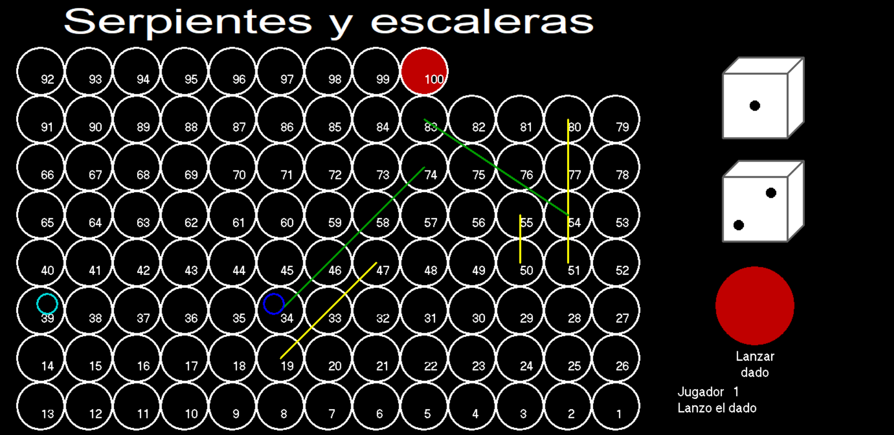
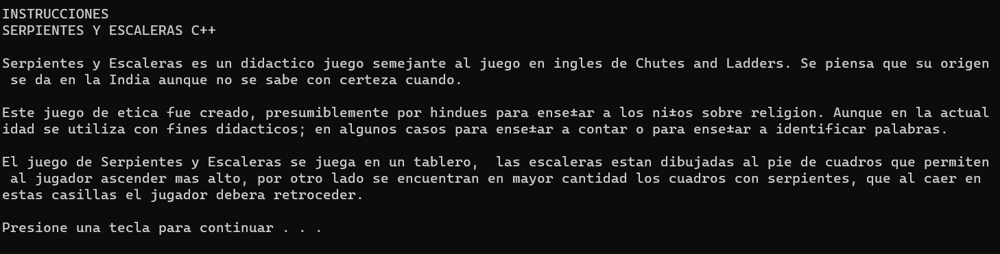

# Serpientes y escaleras
El famoso juego de mesa ahora en tu computadora con tablero personalizable.

El juego comienza con un poco de historia e instrucciones del juego. 

Al presionar cualquier tecla aparece un menú con la siguiente estructura.

## Menú del juego
1. Numero de jugadores.
2. Numero de serpientes.
3. Numero de escaleras.
4. Mostrar informacion de los jugadores.
5. Empezar a jugar.
6. Salir del juego.

### Número de jugadores
En la opción **1** se indica la cantidad de personas que jugarán y debe ser entre 2 y 4 personas.

### Número de serpientes
En la opción **2** se personaliza la cantidad de serpientes que habrá en el tablero. Queda a consideración de los jugadores el número apropiado.

### Número de escaleras
En la opción **3** se personaliza la cantidad de escaleras que habrá en el tablero. Queda a consideración de los jugadores el número apropiado.

### Mostrar información de los jugadores
En la opción **4** se muestra la información de los jugadores, si aún no se han agregado entonces la lista está vacía y se regresa al menú al presionar cualquier tecla.

### Empezar a jugar
En la opción **5** comienza el juego, si aún no se han agregado los jugadores entonces el juego no puede comenzar y le pide al usuario que primero ingrese a los jugadores.

#### Demo

Cabe mencionar, que para ganar el juego, se necesita caer exactamente en la casilla 100. De lo contrario, los jugadores retrodecerán en el tablero la cantidad n que se hayan pasado en su tiro con los dados.

Por ejemplo, si un jugador está en la posición 94 y le toca 7, el jugador terminaría en la casilla 99. Si otro jugador está en 96 y le toca un 6 en los dados, el jugador terminaría en la casilla 98.

### Salir del juego
En la opción **6** se cierra la aplicación.

## Observaciones
Al finalizar aparecerá un mensaje para volver a jugar o salir del juego. Por cuestiones de tiempo no pude terminar esta funcionalidad y no funcionan adecuadamente, por lo que recomiendo cerrar el juego y volver a ejecutar la aplicación, ya que si se intenta volver a jugar se queda la información del juego anterior.

## Sugerencias
Una de las cosas que no agregué al programa fue intercambiar la posición de los jugadores si caen en la misma casilla, aunque he visto que algunos juegos, en sus reglas si permiten que varios jugadores estén en la misma y en otros no.
Como tal yo creo que si estaría interesante y más entretenido que se intercambiaran las posiciones por lo que si alguien desea agregar esta funcionalidad al programa es bienvenido.

Si un programador desea agregar la funcionalidad de volver a jugar borrando la información del juego anterior y sobre el cambio de posición de jugadores, no duden en hacer un pull-up request para agregar estos detalles.